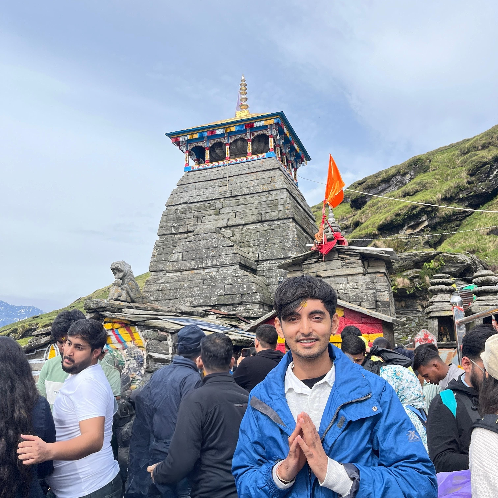

## Rudrashtakam  
**By Goswami Tulsidas**  
*In praise of Bhagavan Shiva*

The **Rudrashtakam** is a revered Sanskrit hymn composed by the 16th-century poet-saint *Goswami Tulsidas*, most widely known for the *Ramcharitmanas*. Unlike most of his works centered around Lord Rama, here Tulsidas offers deep, heartfelt praise to **Lord Shiva**, addressing Him as the supreme formless consciousness (*Nirguna Brahman*), yet also as a compassionate and tangible protector.

The [hymn](https://youtu.be/8ej0guIbXxk) is composed in 8 verses (*ashtakam*) and is often recited by devotees seeking inner peace, surrender, and Shiva’s grace.

---

### ॥ 1 ॥
**नमामीशमीशान निर्वाणरूपं**  
*namami sha-mi-shaan nirvaan roopam*  
I bow to Lord Ishaana, the form of liberation,  

**विभुं व्यापकं ब्रह्मवेदस्वरूपम्।**  
*vibhum vyaa-pa-kam brah-ma-ve-da swa-roo-pam*  
All-pervading, infinite, essence of Brahman and the Vedas.  

**निजं निर्गुणं निर्विकल्पं निरीहं**  
*ni-jam nir-gu­nam nir-vi­kal­pam ni-ree­ham*  
Self-luminous, beyond qualities and thought,  

**चिदाकाशमाकाशवासं भजेऽहम्॥**  
*chi-daa-kaa­sham aa-kaa­sha-vaa­sam bha-je’ham*  
Sky-like Consciousnes, I worship Him with devotion.  

---

### ॥ 2 ॥ 
**निराकारमोंकारमूलं तुरीयं**  
*ni-raa­kar om-kaar moo-lam tu­ree­yam*  
Formless, root of Om, in the fourth supreme state,  

**गिरा ज्ञान गोतीतम् ईशं गिरीशम्।**  
*gi-raa gyaa­nan go-tee­tam ee­sham gi­ree­sham*  
Beyond speech, thought, and senses; Lord of Kailash.  

**करालं महाकाल कालं कृपालं**  
*ka-raalam ma-haa­kaal kaa­lam kri-paa­lam*  
Fierce, greater than Time, yet deeply compassionate,  

**गुणागार संसारपारं नतोऽहम्॥**  
*gu-naa-gaar sam-saa­ra pa­aram na­to’ham*  
Who lifts us beyond worldly cycles, I bow to Him.  

---

### ॥ 3 ॥
**तुषाराद्रिसंकाशगौरं गभीरं**  
*tu-shaa­raa­dri san-kaash gauram ga­bheeram*  
White as Himalayan snow, calm and profound,  

**मनोभूतकोटिप्रभाश्रीशरीरम्।**  
*ma­no-bhoo­ta ko­tee pra-bhaa shree she­ree­ram*  
Body shining with the radiance of countless minds.  

**स्फुरन्मौलिकल्लोलिनी चारुगङ्गा**  
*sphur­an mau­li kal-lo­li­nee chaa­ru gan­gaa*  
Ganga flows from His jeweled crown,  

**लसद्भालबालेंदु कण्ठे भुजङ्गा॥**  
*la­sat bhaal baa­len­du kan­the bhu­jangaa*  
With crescent moon on His brow and serpent on His neck.  

---

### ॥ 4 ॥
**चलत्कुण्डलं भ्रूसुनेत्रं विशालं**  
*cha­lat kund­a­lam bhru-su net­ram vi­shaa­lam*  
Earrings swinging, brows and eyes wide and graceful,  

**प्रसन्नाननं नीलकण्ठं दयालम्।**  
*pra saan na­nam nee la kan­tham da­yaa­lam*  
Smiling face, blue-throated, full of compassion.  

**मृगाधीशचर्माम्बरं मुण्डमालं**  
*mri gaa­dheesh char­maam ba­ram mun­da maa­lam*  
Draped in tiger skin, with skull garland,  

**प्रियं शङ्करं सर्वनाथं भजामि॥**  
*pri yam shan­ka­ram sar­va naa­tham bha­jaa­mi*  
I worship Shankara, beloved Lord of all.  

---

### ॥ 5 ॥
**प्रचण्डं प्रकृष्टं प्रगल्भं परेशं**  
*pra chan­dam pra krish­tam pra­galbham pa­resham*  
Fierce, supreme, fearless, highest of gods,  

**अखण्डं अजं भानुकोटिप्रकाशम्।**  
*a­khan­dam a jam bhaa­nu ko­ti pra­kaa­sham*  
Undivided, unborn, shining like a million suns.  

**त्र्यःशूलनिर्मूलनं शूलपाणिं**  
*trya shool nir moo­lanam shool paa­nim*  
Holder of the trident that uproots three-fold sorrows,  

**भजेऽहं भवानीपतिं भावगम्यम्॥**  
*bha je’ham bha­vaa­nee pa­tim bhaa­va ga­myam*  
I worship Bhavani’s Lord, attained through devotion.  

---

### ॥ 6 ॥
**कलातीतकल्याण कल्पान्तकारी**  
*ka­laa­teet ka­lya­an kal paa­nta kaa­ree*  
Beyond time, ever-auspicious, ender of creation,  

**सदा सज्जनानन्ददाता पुरारी।**  
*sa­daa saj­ja­naa naan­da daa­taa pu­raa­ree*  
Giver of bliss to the righteous, slayer of Tripura.  

**चिदानन्दसंदोह मोहापहारी**  
*chi daa naan­da san­doh mo­haa pa­haa­ree*  
Ocean of bliss and consciousness, remover of illusion,  

**प्रसीद प्रसीद प्रभो मन्मथारी॥**  
*pra seed pra seed pra bho man ma­thaa­ree*  
Be gracious, O Lord, destroyer of desire, be gracious.  

---

### ॥ 7 ॥
**न यावदुमानाथपादारविन्दं**  
*na yaa vad u maa­naath paa daa ra vin­dam*  
Until one worships Uma’s Lord’s lotus feet,  

**भजन्तीह लोके परे वा नराणाम्।**  
*bha jan­tee hi lo ke pa­re va naa­raa­naam*  
No peace or joy in this world or the next.  

**न तावत्सुखं शान्तिसन्तापनाशं**  
*na taa­vat su­kham shaan­tee san taa­pa naa­sham*  
No end to suffering nor attainment of bliss,  

**प्रसीद प्रभो सर्वभूताधिवासं॥**  
*pra seed pra bho sar­va bhoo­taa dhi­vaa­sam*  
Be kind, O Lord who dwells in all beings.  

---

### ॥ 8 ॥
**न जानामि योगं जपं नैव पूजां**  
*na jaa naa mi yo­gam ja­pam na­ev poo­jaam*  
I know not yoga, nor chant, nor ritual worship,  

**नतोऽहं सदा सर्वदा शम्भुतुभ्यम्।**  
*na to’ham sa­daa sar­va daa sham­bhu tub­hyam*  
Always and forever, I bow to You, O Shambhu.  

**जराजन्मदुःखौघ तातप्यमानं**  
*jaa raa jan ma du kh­ha ou ghat taa­ta­pya maa­nam*  
Burnt by pains of age, birth, and sorrow,  

**प्रभो पाहि आपन्नमामीश शंभो॥**  
*pra bho paa hi aa­pan na maa­mee sha shambho*  
O Lord, protect me, Shambhu, I surrender to You.  

---

**रुद्राष्टकमिदं प्रोक्तं विप्रेण हरेतोषये।**  
*rud­raa­shta­kam i­dam prokt­am vip­reṇ ha­re to­shaye*  
This Rudrashtakam, spoken by sages to please Lord Hare,  

**ये पठन्ति नरा भक्त्या तेषां शम्भुः प्रसीदति॥**  
*ye pa­than­ti na­raa bhak­tyaa te­shaaṁ sham­bhuḥ pra­se­e­dati*  
Whoever recites it with devotion, Shambhu is pleased with them.  

**My recent trip to Tungnath, one of the highest Lord Shiva temples in the world.**
