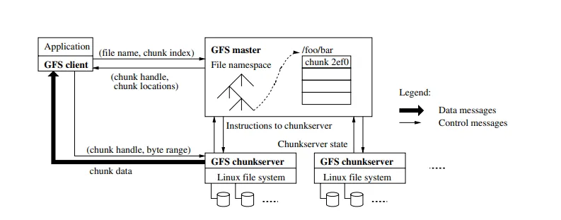

<!-- # Exploring the Power of Google File System: The Distributed Storage System That Revolutionized Big Data -->

The paper *The Google File System* by Sanjay Ghemawat, Howard Gobioff, and Shun-Tak Leung (Google) presents details of a distributed file system designed to support distributed applications and the various assumptions and design decisions that were made.

Credit: [google.com](https://www.google.com)

## Introduction

From the introduction of the paper, we have the following:

> We have designed and implemented the Google File System (GFS) to meet the rapidly growing demands of Google's data processing needs. GFS shares many of the same goals as previous distributed file systems such as performance, scalability, reliability, and availability. However, its design has been driven by key observations of our application workloads and technological environment, both current and anticipated, that reflect a marked departure from some earlier file system design assumptions.

The decisions made while designing and implementing GFS mainly focused on the fact that there was a need for a scalable distributed file system that would be used in conjunction with large distributed data-intensive applications, for example, MapReduce.

The designers understood that on a file system distributed across hundreds or even thousands of machines, the chances of some computers failing would be significantly higher, so they designed the GFS with monitoring, error detection, fault tolerance, and recovery in mind.

Since the file system is also designed for large data-intensive applications, the files that they would have to store would be larger than the traditional standards.

It was found that the majority of the writes that the applications performed were appending the new data at the end of the file. Random writes on files were practically non-existent. Once the data was written, it was only read and that too was often only sequential reads.

## Assumptions

There are several core assumptions that constrain the design of GFS, and they are centered around the typical workload of GFS clients. The in-detail assumptions are as follows:

- **The system is built from many inexpensive commodity components that often fail.**  
  The assumption is that on a distributed file system operating at such a large scale, the chances that at any given time some components might not be functional is really high, so they have incorporated constant monitoring, fault detection, tolerance, and recovery into the design.

- **The system stores a modest number of large files.**  
  We expect a few million files, each typically 100 MB or larger in size. Multi-GB files are the common case and should be managed efficiently. Small files must be supported, but we need not optimize for them.  
  GFS is designed to store a large number of large files (>100 MB) consisting of 64 MB chunks.

- **The workloads primarily consist of two kinds of reads:**  
  - **Large streaming reads** (hundreds of KBs to MBs). Successive operations from the same client often read through a contiguous region of a file.  
  - **Small random reads**, typically reading a few KBs at some arbitrary offset. Performance-conscious applications often batch and sort their small reads to advance steadily through the file rather than go back and forth.

- **The workloads also have many large, sequential writes that append data to files.**  
  Typical operation sizes are similar to those for reads. Once written, files are seldom modified again. Small writes at arbitrary positions in a file are supported but do not have to be efficient.

- **The system must efficiently implement well-defined semantics for multiple clients that concurrently append to the same file.**  
  GFS files will typically experience highly concurrent append-heavy workloads, and it's crucial these operations are implemented by the system efficiently.

- **High sustained bandwidth is more important than low latency.**  
  Clients tend to engage in large data processing jobs, which rely on maintaining sustained high bandwidth, more so than optimizing for individual operation latency.

## Interface

GFS provides an interface that supports all the usual operations that are expected from a file system such as creating, deleting, opening, closing, reading, and writing files.

Apart from this, GFS also provides snapshot and record append operations. Snapshot creates a copy of a file or a directory tree at a low cost. Record append allows multiple clients to append data in the same file concurrently while ensuring the atomicity of the append operation.

## Architecture

As mentioned earlier, GFS runs on a typical commodity Linux machine. A typical GFS consists of a single master and multiple chunkservers and is accessed by multiple clients. Chunkservers and clients can run on the same machines as long as the resources available on the machine permit that.

Files are divided into fixed-size chunks (typically 64 MB). Each of the chunks has a 64-bit chunk handle, assigned to it by the master, which is used for identifying the chunk. For reliability, each of the chunks is replicated on 3 chunkservers by default.

The metadata for the whole file system is maintained by the master in its memory. This metadata includes the namespace, access control information, the mapping from files to chunks, and the current locations of chunks.

**Figure 1: GFS Architecture**

It might have come to your attention that GFS only has a single master, this decision significantly reduces the complexity of the whole system since only the single master is in charge of all the chunk placement and replication decisions, instead of the case where there are multiple masters and there has to be some sort of communication between the masters to come to some agreement, which both increase the complexity and decrease the responsiveness of the whole system.

But since GFS only has a single master, the designers had to make sure that the master does not become a bottleneck for the system.

Clients never read and write file data through the master. Instead, a client asks the master which chunkservers it should contact. It caches this information for a limited time and interacts with the chunkservers directly for many subsequent operations.

One benefit of the client caching the information of the chunk is that the master includes the information immediately following that chunk, which saves the client having to contact the master again and again for a certain period of time.

## Metadata

The master stores three types of metadata:
1. The file and chunk namespaces.
2. The mapping from files to chunks.
3. The location of each chunk's replicas.

All of this is stored in the master's memory. The first two types, along with certain critical metadata changes, are also kept persistent on an operation log stored in the master's local disk and replicated on remote machines.

The main benefit of keeping the metadata in memory is to decrease the time to perform these operations at the master. Certain other activities also become easier to perform in the background because of this. The master periodically scans its whole state to implement chunk garbage collection, re-replicate certain chunks in case of failure of the chunkservers storing them, and chunk migration for load and disk space balancing across the chunkservers.

The master doesn't keep a record of which chunkservers contain which chunks in persistent storage; it simply polls the chunkservers for that information at the startup and thereafter keeps itself up-to-date since the master will be the one making decisions about chunk placement. The master monitors the health of the chunkservers with regular HeartBeat messages.

## Consistency Guarantees by GFS

File namespace mutations are atomic since the master exclusively handles these mutations. The operation log present at the master defines a global total order for all of these operations.

GFS supports a relaxed consistency model that works well with highly distributed applications and is also relatively simple and efficient. It is important to keep in mind that the reason GFS can work with such relaxed consistency guarantees is because of the intimate understanding of the workloads of its clients.

Data mutations may be writes or record appends. A write causes data to be written at an application-specified file offset. A record append causes data (the "record") to be appended atomically at least once even in the presence of concurrent mutations, but at an offset of GFS's choosing… The offset is returned to the client and marks the beginning of a defined region that contains the record.

As we saw earlier, clients cache the locations of certain chunks that they are currently reading from. It is possible that they may read from a stale replica before the information on that chunk replica is updated. But since most of the files are append-only, a stale replica will only return a premature end of chunk rather than outdated data. When the client retries and contacts the master, it will immediately be pointed to chunks with up-to-date data.

## System Interactions

As we saw earlier, the system is designed in a way that minimizes the involvement of the master in all operations as much as possible.

To handle the mutation operations, GFS uses leases. Mutation operations consist of a write or a record append operation. Each mutation operation is performed on all of the chunk's replicas.

The master grants a chunk lease to one of the chunkservers that hold a certain chunk; this chunkserver is now known as the primary.

Whenever a client wants to perform a mutation operation, the client asks the master which chunkserver holds the current lease for the chunk and the locations of the other replicas.

The master replies with the identity of the primary and the location of other replicas. The client caches this data. The client needs now only to contact the master in case the primary server stops responding or replies that it no longer holds the lease.

The client pushes the data that it needs to write/append to all of the replicas.

Once all the replicas have acknowledged receiving the data, the client sends a write request to the primary. The primary assigns an order to all the mutations that it has received from the client (possibly multiple). It applies the mutation to its local state.

The primary forwards the write request to all the replicas, and each replica applies the mutations in the same order provided by the primary.

Once all the replicas reply to the primary indicating that they have completed the operation, the primary replies to the client that the mutation has succeeded.

Any errors encountered at any of the replicas are reported to the client. In case of errors, the write may have succeeded at the primary and an arbitrary subset of the secondary replicas. (If it had failed at the primary, it would not have been assigned a serial number and forwarded.) The client request is considered to have failed, and the modified region is left in an inconsistent state. Our client code handles such errors by retrying the failed mutation.

Here one can observe the design decision to decouple the flow of data from the flow of control. Once the primary chunkserver has a lease from the master, the client or the chunkserver doesn't need to communicate with the master, and the data can flow directly from the client to the chunkserver or vice-versa.

Another aspect of this is when the control flows from the client to the primary and then to the secondaries, the data can be pushed linearly across a chain of chunkservers in a pipelined fashion, ensuring that the network capacity of all the machines is utilized properly.

Thus, decoupling the flow of data from the flow of control adds an element of network optimization.

## Stale Replica Detection

Chunk replicas on a chunkserver might become stale if that chunkserver is down during some mutation on the chunks it contains. For each chunk, the master maintains a chunk version number to distinguish between up-to-date and stale replicas.

Whenever the master grants a new lease on a chunk, it increases the chunk version number and informs the up-to-date replicas. The master and these replicas all record the new version number in their persistent state.

This ensures that any replica that was not updated while the mutation happened would contain an older version number. So, when it comes back up and reports its chunks and their associated version numbers, the master can detect that the chunks it contains are stale.

The master removes these stale replicas during its regular garbage collection. Before that, the master considers them to not exist at all, and when any client requests chunk information, these stale replicas are not reported. As a safeguard, the master also provides the client with the latest chunk version number so that the client can verify that it is always accessing up-to-date data.

## Key Takeaways

There are many remarkable elements of the Google File System, some of the important ones I would like to highlight are:

- Demonstrating that large-scale highly-distributed operations such as this distributed file system can be supported by the means of regular commodity hardware.
- Separation of data flow from control flow, allowing better utilization of the network and also making the single master architecture feasible.
- Aggressively designing all elements of the system for specific client workloads, which makes it possible to have different or simpler consistency guarantees.

---
