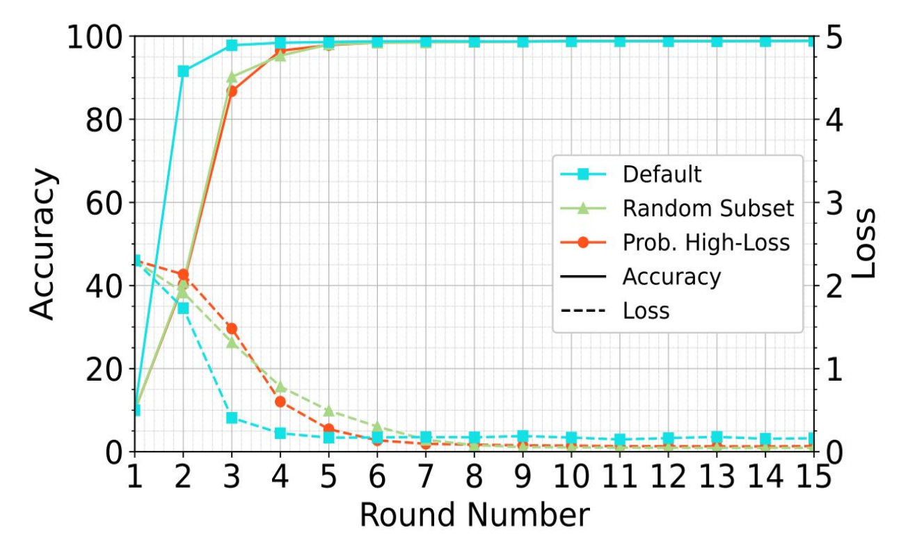

# ### Framework Architecture
# 

#### Highlights

• Flotilla enables modular and intuitive composition of federated learning strategies.
• It supports both synchronous and asynchronous strategies on diverse edge devices.
• It handles both client and server failures for resilient training.
• It scales efficiently to 1000+ clients and exhibits superior weak-scaling.

# ### Experimental Insights

# We evaluated different client selection strategies in a lab testbed comprising homogeneous Raspberry Pi devices connected via Gigabit LAN. In an IID data setting, where local models are inherently aligned, the **Default** strategy showed the fastest convergence due to receiving the highest number of updates per round.

# **Random Selection (RS)** and **Partial Heterogeneous Loss (PHL)** performed similarly, as client validation losses were nearly identical across rounds. The absence of stragglers ensured that training durations remained consistent across clients. However, PHL showed periodic increases in training time due to validation overhead every alternate round.

# The model converged in **100 FL rounds**, reaching **98.4% accuracy**, with an **average round time of 375 seconds**.

# 

# ### Press
# * ["Towards a Modular Federated Learning Framework on Edge Devices"](https://2023.hipc.org/srs-2023/#:~:text=Towards%20a%20Modular%20Federated%20Learning%20Framework%20on%20Edge%20Devices) at HiPC 2023 Student Research Symposium
