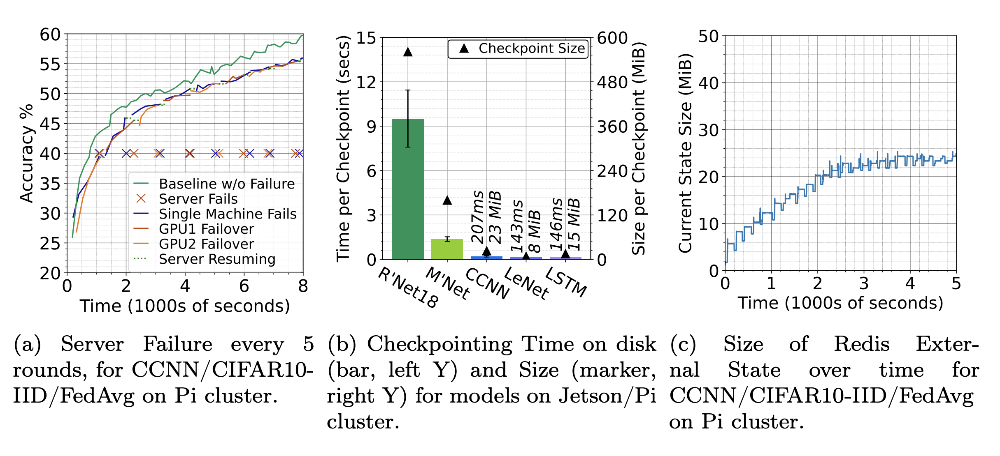

  This builds further upon our initial model agnostic federated learning framework, discussed [here](https://princemodi.me/publication/conference-poster/hipc-srs-2023/). The framework described there was completely synchronous and did not support any checkpointing mechanism (yet). The framework we describe in this paper is almost a total rewrite. We moved away from a synchronous framework, deciding to add support for asynchronous federated learning strategies. We further implemented the newer version with a clearer separation of states in mind, which later helped us integrate checkpointing and reliability into this framework.

  ### My Contribution

  I was involved in the design and development of Flotilla from the ground-up. I implemented or was part of the group implementing 
  all the core components, and was also involved in the initial design and setup of the evaluation framework to study the system's
  behavior under expected, high-load, and failure conditions.

  Out of various components of this framework, one that I am most proud of is the Server Failure and Recovery using state checkpointing.
  We designed an external state store using Redis, that stores all the important state of the server during a machine learning training task.
  We also implemented a periodic disk-based checkpointing, as a back-up for our Redis state-store. Designing and testing this component was 
  the most fun I have had while working on this project. See Sections [3.5](https://arxiv.org/pdf/2507.02295#page=19&zoom=100,0,500) and [4.4](https://arxiv.org/pdf/2507.02295#page=31&zoom=100,0,400) in the paper for more details!

  
  

    <strong>Figure 1.</strong> Some graphs about the checkpointing mechanism.  
    <em>Source: Flotilla: A scalable, modular and resilient federated learning framework for heterogeneous resources, Journal of Parallel and Distributed Computing, 2025.</em>
  

  
  I coauthored the initial drafts of the paper, focusing on articulating the systems perspective, including modular design,
  fault tolerance, and large-scale deployment challenges.
